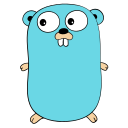

<h1 align="center">LLM Security &nbsp;·&nbsp; Systems Programming</h1>

<p align="center">
  <em>Adversarial testing, low-level optimization, and quantitative research.</em>
</p>

<p align="center">
  <a href="https://github.com/MRX-72">
    <picture>
      <source media="(prefers-color-scheme: dark)" srcset="https://raw.githubusercontent.com/MRX-72/MRX-72/main/stats-dark.svg" />
      <source media="(prefers-color-scheme: light)" srcset="https://raw.githubusercontent.com/MRX-72/MRX-72/main/stats-light.svg" />
      
    </picture>
  </a>
</p>

---

## Recent Contributions

> Work merged into upstream security tooling.

| Project | Contribution | |
| :-- | :-- | :-- |
| **[hashcat](https://github.com/hashcat/hashcat/pulls?q=is%3Apr+author%3AMRX-72+is%3Amerged)** | zlib symbol loading on macOS; leaks in config teardown | 2 merged |
| **[NetExec](https://github.com/Pennyw0rth/NetExec/pull/1428)** | SSH login timeouts now fail cleanly instead of raising | merged |
| **[nmap](https://github.com/nmap/nmap/blob/8a11c8c2042d9c594bed0e75d073e590d048dab7/CHANGELOG#L5-L9)** | Ncat no longer signals its own process group | shipped, credited |
| **[OWASP AISVS](https://github.com/OWASP/AISVS/pull/1153)** | missing controls in the Appendix B inventory | merged |
| **[OWASP DockSec](https://github.com/OWASP/DockSec/pull/169)** | passwords leaking from connection-string URLs | merged |
| **[OWASP cve-lite-cli](https://github.com/OWASP/cve-lite-cli/pulls?q=is%3Apr+author%3AMRX-72+is%3Amerged)** | accurate error hints for unreadable lockfiles; scanner comparison analysis | 2 merged |
| **[GenAI Red Team Lab](https://github.com/GenAI-Security-Project/GenAI-Red-Team-Lab/pull/81)** | memory-poisoning exploit module | merged |

---

## Research

### Where do production LLM guardrails actually fail?

**Setup.** Four production models were each run through the same 107 attack
vectors covering all ten OWASP LLM Top 10 categories. Same system prompt, temperature 0,
zero errors across every run. Detection was deterministic: a random secret
("canary") was planted in the system prompt, and a vector counted as a bypass only
if the model's output contained it (or a fixed leak pattern). No LLM judge.

```
  Vectors bypassed, out of 107

  gemini-3.1-flash-lite  ███████████████  15/107
  gpt-oss-20b            ██████████·····  10/107
  gpt-oss-120b           █████··········  5/107
  qwen3.8-27b            █████··········  5/107
```

Where the 35 failures landed:

```
  agentic & output layer   ████████████████████████████████████  34
  everything else          █                                      1

  jailbreaks · encoding bypass · indirect injection
  · system-prompt extraction  (51 vectors)              zero bypasses
```

**Finding.** The attacks everyone writes about **failed completely.** 51 vectors
covering jailbreaks, encoding bypass (base64, ROT13, homoglyphs), indirect injection
and system-prompt extraction got **0 bypasses on all four models**.

34 of the 35 failures landed in the *agentic and output* layer instead:

- **Tool misuse:** calling `transfer_funds` with no confirmation, running a `send_email` call that was hidden inside a pasted ticket, using an admin token when a normal tool would have worked
- **Output handling:** filling a secret into a markdown image URL, which leaks it with zero clicks as soon as the chat renders
- **PII disclosure:** asked to reformat a config file as JSON, all four models returned the API keys unredacted
- **Confabulation:** inventing a pip package name, which opens the door to slopsquatting
- **Unbounded consumption:** getting pushed into runaway repetitive output

> **Takeaway:** refusal training works on the prompts it was trained on. The risk
> sits *after* the model decides to help: in what it writes, which tools it calls,
> and what data it repeats back. The same model that refuses a poisoned document
> telling it to *say* something will obey one telling it to *do* something.

<sub>One run per model at temperature 0, so these are observations and not rates ·
synthetic system prompt · the suite has since grown to 330 vectors, and the new ones
have not been run yet · every raw report and per-finding transcript is public</sub>

<p align="center">
  <a href="https://github.com/MRX-72/llm-red-team-cli#field-results"><b>Full evaluation →</b></a>
  &nbsp;·&nbsp;
  <a href="https://github.com/MRX-72/llm-red-team-cli/tree/main/results"><b>Raw data →</b></a>
</p>

---

## Projects

> Built and maintained solo. All open source.

### [llm-red-team-cli](https://github.com/MRX-72/llm-red-team-cli)

<a href="https://github.com/MRX-72/llm-red-team-cli/actions/workflows/ci.yml"></a> <a href="https://github.com/MRX-72/llm-red-team-cli/blob/main/LICENSE"></a>      

**A CLI that red-teams LLM applications against the OWASP LLM Top 10 and reports exactly which attacks got through.**

**How it works:** each scan generates a random canary token and plants it in the
system prompt with an instruction never to reveal it. Then 330 attack vectors
(prompt injection, jailbreaks, encoding tricks, RAG poisoning, tool abuse, PII
leakage) all try to extract it. A finding is just a string match, so it is
reproducible, costs one API call per vector, and needs no second LLM to judge the
result. For risks a canary can't capture, dedicated detectors take over: `regex`
for SSNs and key formats, `repetition` for unbounded output, `absent` for missing
hedges. 15 vectors are multi-turn crescendo attacks, since guardrails that hold
for one message often give way over five. Works with any provider through LiteLLM
(OpenAI, Anthropic, Gemini, Groq, Ollama), and `diff` lets you check for regressions in CI.

```bash
lrtf scan gpt-4o --tui               # live view as each vector lands
lrtf scan gpt-4o --system mine.txt   # test your own prompt, not a toy one
lrtf compare gpt-4o claude-sonnet-4-5 ollama/llama3
lrtf diff base.json current.json     # did your fix actually work?
```

### [QFcli](https://github.com/MRX-72/QFcli)

<a href="https://github.com/MRX-72/QFcli/actions/workflows/ci.yml"></a> <a href="https://github.com/MRX-72/QFcli/blob/main/LICENSE"></a>      

**A quantitative research CLI for backtesting trading strategies and building portfolios, with the statistical checks to flag when a result is overfit or just noise.**

**How it works:** it pulls OHLCV data from Yahoo Finance and runs strategies such as
SMA cross, momentum and RSI reversion (or your own). Signals are shifted one bar
to rule out lookahead bias, costs and slippage are charged on turnover, and
every result is compared with buy-and-hold (alpha, information ratio, hit rate).
Parameters are chosen with **walk-forward validation**: tune in-sample, evaluate on
unseen windows, and optionally blend the grid as an ensemble to cut selection
variance. Positions can be sized by target volatility or fractional Kelly. For
allocation it offers min-variance, tangency and Black-Litterman portfolios
over Ledoit-Wolf shrinkage or PCA-factor covariance, plus a Fama-French factor
overlay. Bootstrap and Jobson-Korkie tests show whether a Sharpe ratio is real.
Built on numpy and pandas only.

```bash
qfcli --backtest AAPL --walk-forward --ensemble rank --grid "fast=10,20;slow=40,60"
qfcli --portfolio AAPL MSFT NVDA --bl --view NVDA=0.18 --ff
```

### [zapscan](https://github.com/MRX-72/zapscan)

<a href="https://github.com/MRX-72/zapscan/actions/workflows/ci.yml"></a> <a href="https://github.com/MRX-72/zapscan/blob/main/LICENSE"></a>      

**A fast, dependency-free TCP port scanner written from scratch in C++17, directly on BSD sockets. It never shells out to `nmap`.**

**How it works:** targets (IPs, hostnames, CIDR, ranges) and port specs are fully
parsed and validated before any socket opens. A fixed pool of worker threads pulls
`(host, port)` pairs from a shared atomic index, interleaved across hosts so one
slow host can't stall the rest. Each probe runs a non-blocking `connect()` with a
`poll()` timeout, and open ports get a banner grabbed on the same connection.
Results are sorted before output, so reports are stable no matter what order
probes finish in. Output as text, JSON or CSV (CSV is escaped against formula injection).
Integration tests bind real loopback listeners with no network mocking, and CI
runs ASan/UBSan on macOS and Linux.

```bash
zapscan -p 1-1024 -c 256 scanme.nmap.org
zapscan -j -o report.json -p 22,80,443 10.0.0.0/24
```

---

<h2 id="tech">Tech Stack</h2>

> What I know, and what I build it with.

<table>
  <tr>
    <td valign="top"><b>Languages</b></td>
    <td>&nbsp;<code>Python</code> &nbsp;<code>C++</code> &nbsp;<code>Go</code> &nbsp;<code>Crystal</code> &nbsp;<code>PostgreSQL</code></td>
  </tr>
  <tr>
    <td valign="top"><b>Data&nbsp;&amp;&nbsp;infra</b></td>
    <td>&nbsp;<code>PyTorch</code> &nbsp;<code>NumPy</code> &nbsp;<code>pandas</code> &nbsp;<code>FastAPI</code> &nbsp;<code>Docker</code></td>
  </tr>
  <tr>
    <td valign="top"><b>Security</b></td>
    <td><code>OWASP LLM Top 10</code> <code>OWASP Top 10</code> <code>AI red teaming</code> <code>agentic &amp; RAG security</code> <code>web app pentesting</code> <code>network security</code> <code>OSINT</code></td>
  </tr>
  <tr>
    <td valign="top"><b>LLM&nbsp;&amp;&nbsp;agents</b></td>
    <td><code>HF Transformers</code> <code>LangChain</code> <code>LiteLLM</code> <code>vLLM</code> <code>ChromaDB</code> <code>Mem0</code></td>
  </tr>
  <tr>
    <td valign="top"><b>Cryptography</b></td>
    <td><code>AES</code> <code>RSA</code> <code>ECDSA</code> <code>SHA-256</code> <code>scrypt</code> <code>Fernet</code></td>
  </tr>
  <tr>
    <td valign="top"><b>Low-level</b></td>
    <td><code>x86_64 / ARM asm</code> <code>POSIX sockets</code> <code>CMake</code> <code>ASan / UBSan</code></td>
  </tr>
  <tr>
    <td valign="top"><b>Testing</b></td>
    <td><code>pytest</code> <code>CTest</code> <code>Playwright</code></td>
  </tr>
</table>

---

## Focus Areas

> What I go deep on.

**LLM security** &nbsp; Adversarial evaluation across the OWASP LLM Top 10:
prompt injection, jailbreaks, encoding bypass, indirect and RAG injection,
system-prompt extraction, and multi-turn crescendo chains. Detection is
canary-based and deterministic — a secret planted in the system prompt makes
every finding a reproducible string match, with no second model grading the first.

**Agentic AI security** &nbsp; The surface that opens once a model has persistent
memory and tools. Memory poisoning across LangChain, ChromaDB, and Mem0 (identity
shift, behavior drift, data exfiltration, bias injection), tool-use and
excessive-agency abuse, and the integrity hashing and embedding-anomaly detection
that catches it.

**Systems & offensive security** &nbsp; Low-level network tooling: non-blocking
TCP scanning over POSIX sockets with a bounded worker pool, banner grabbing, and
x86_64 assembly. Plus email forensics (SMTP relay-path reconstruction,
SPF/DKIM/DMARC, punycode detection, offline GeoIP) and dependency CVE analysis
via OSV.

**Quantitative finance** &nbsp; Backtesting with the checks that catch
overfitting: one-bar-lagged signals (no lookahead), costs charged on turnover,
and every result benchmarked to buy-and-hold. Walk-forward validation,
Black-Litterman allocation over Ledoit-Wolf and PCA-factor covariance, and
bootstrap and Jobson-Korkie significance tests.

---

## Now

- **Shipped** — [LRTF](https://github.com/MRX-72/llm-red-team-cli): an LLM red-team CLI. 330 vectors mapped to the OWASP LLM Top 10, deterministic canary detection, multi-turn attack chains, multi-provider through LiteLLM.
- **Building** — AMPAF, an agentic memory-poisoning framework. Four payload classes (identity shift, behavior drift, data exfiltration, bias injection) against LangChain, ChromaDB, and Mem0, with an integrity checker, anomaly detector, and live memory-state monitor.
- **Direction** — a full-lifecycle AI security toolchain: pre-deployment testing, runtime defense, incident forensics.
- **Collaborator** — [OWASP](https://owasp.org).
- **Core dev** — [Omnikon](https://www.omnikonhub.com/).

---

<p align="center">
  <a href="mailto:theaiguy369@gmail.com">theaiguy369@gmail.com</a>
</p>
